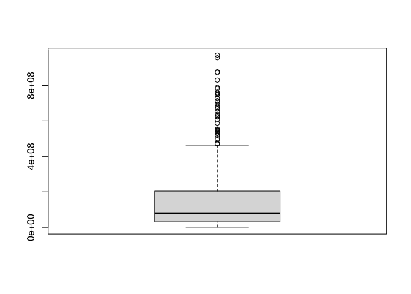
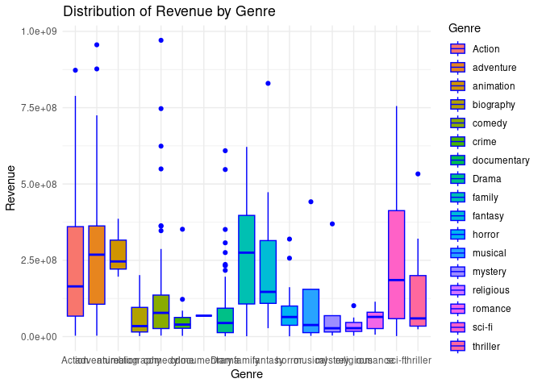

# Project Overview

Introduction

This R project analyzes a movie dataset to explore patterns in revenue, genres, budgets, and directorial performance. It demonstrates how data analysis and visualization in R can uncover valuable business and entertainment insights.

Project Goal

Clean and transform raw movie data for analysis.

Investigate revenue trends by genre and director.

Create meaningful visualizations using ggplot2.

Summarize results to identify high-performing directors and genres.

Key Questions

Which movie genres generate the most revenue?

Which directors have directed the most movies?

What is the total revenue per director?

Are there outliers in the revenue data?

How does revenue relate to budget?
#  packages and library you need before beginning the R project:
Firstly To install the tidyverse — a collection of essential R packages for data science — run the following command in your R console or RStudio:
Packages	Purpose:

Installing tidyverse automatically installs core packages such as:

ggplot2 – for data visualization

dplyr – for data manipulation

tidyr – for data tidying

readr – for reading data (CSV, TSV, etc.)

purrr – for functional programming

tibble – for enhanced data frames

stringr – for string manipulation

forcats – for working with categorical variables

# Package Installation and Loading
Code to install different packages:

install.packages("tidyverse")
install.packages("skimr")
install.packages("stringr")
install.packages("readr")
install.packages("ggplot2")

library(tidyverse)
library(skimr)
library(stringr)
library(readr)
library(ggplot2)


``` r
install.packages("tidyverse")
```

```
## Error in install.packages : Updating loaded packages
```

#Load it in your script or RMarkdown using below code:


``` r
library(tidyverse)
```

#dplyr	For data manipulation (filtering, grouping, summarising, etc.)
#ggplot2	For creating visualizations like bar plots, boxplots, etc.
#readr	For reading CSV files efficiently
#tidyr	For reshaping and cleaning data
#stringr	For string/text operations (e.g., lowercase conversion)
#forcats	For handling categorical variables (factors)
#readxl	(Optional) If working with Excel files
#skimr or summarytools	(Optional) For quick summary statistics


``` r
install.packages("dplyr")
```

```
## Error in install.packages : Updating loaded packages
```


``` r
library(dplyr)
```


``` r
install.packages("tidyr")
```

```
## Error in install.packages : Updating loaded packages
```


``` r
library(tidyr)
```


``` r
library(ggplot2)
```


``` r
library(skimr)
```


``` r
install.packages("readr") 
```

```
## Error in install.packages : Updating loaded packages
```


``` r
library(readr) 
```


``` r
install.packages("stringr")
```

```
## Error in install.packages : Updating loaded packages
```


``` r
library(stringr)
```

- **Load the Data:**
    - Load your data from a CSV file using `read.csv()`.
- **Explore the Data:**
    - Use `head()`, `summary()`, and `str()` to understand the data.
- **Handle Missing Values:**
    - Remove missing values using `na.omit()`.
    - Alternatively, impute missing values with mean or median using `mean()` or `median()`.
- **Remove Duplicates:**
    - Use `duplicated()` to remove duplicate rows.
- **Fix Column Names:**
    - Rename columns to avoid spaces using `gsub()`.
- **Filter Irrelevant Data:**
    - Use `filter()` to remove unnecessary rows or columns.
- **Transform Data:**
    - Convert columns to appropriate types using `as.numeric()`, `as.factor()`, etc.
    - Create new columns using `mutate()`.
- **Handle Outliers:**
    - Identify outliers using boxplots or scatter plots and remove them.
- **Standardize Categorical Variables:**
    - Ensure consistent naming for categorical data using `recode()`.
- **Save Cleaned Data:**
    - Save the cleaned data to a new file using `write.csv()`.
    
# Load Dataset

 \*\*Read the Data File (movies_data.csv) If you have the Movies.csv file
    uploaded or placed in a directory, you can use the read.csv function
    to load it into R. \# Read and load the data (movies_data.csv file) into
    a data frame

Read and load the data (movies_data.csv file) into a data frame


``` r
movies_data <-
read.csv("/cloud/project/movies_data.csv")
```

# Initial Exploration

Steps to data Cleaning first of all explore the data using head(), summary(), and str()

View the first few rows of the data 

``` r
head(movies_data) 
```

```
##              Movie.Title Release.Date
## 1         22 Jump Street   2014-06-04
## 2                     71   2014-02-07
## 3 A Good Day to Die Hard   2013-02-14
## 4             Battleship   2012-05-18
## 5             Black Mass   2015-09-04
## 6               Criminal   2016-04-15
##                                          Wikipedia.URL  Genre Director._1_
## 1         https://en.wikipedia.org/wiki/22_Jump_Street Action    Phil Lord
## 2         https://en.wikipedia.org/wiki/%252771_(film) Action Yann Demange
## 3 https://en.wikipedia.org/wiki/A_Good_Day_to_Die_Hard Action   John Moore
## 4      https://en.wikipedia.org/wiki/Battleship_(film) Action   Peter Berg
## 5      https://en.wikipedia.org/wiki/Black_Mass_(film) Action Scott Cooper
## 6   https://en.wikipedia.org/wiki/Criminal_(2016_film) Action Ariel Vromen
##   Director._2_            Cast._1_       Cast._2_             Cast._3_
## 1 Chris Miller      Channing Tatum     Jonah Hill             Ice Cube
## 2                   Jack O'Connell Richard Dormer          Sean Harris
## 3                     Bruce Willis   Jai Courtney       Sebastian Koch
## 4              Alexander Skarsgård  Taylor Kitsch      Brooklyn Decker
## 5                      Johnny Depp  Joel Edgerton Benedict Cumberbatch
## 6                    Kevin Costner    Gary Oldman      Tommy Lee Jones
##        Cast._4_        Cast._5_    Budget   Revenue
## 1                                84500000 331300000
## 2      Sam Reid                   8100000   2900000
## 3 Yuliya Snigir Radivoje Bukvić  92000000 304700000
## 4       Rihanna     Liam Neeson 220000000 303000000
## 5 Sienna Miller  Dakota Johnson  53000000  99800000
## 6     Alice Eve       Gal Gadot  31500000  35600000
```

``` r
summary(movies_data)
```

```
##  Movie.Title        Release.Date       Wikipedia.URL         Genre          
##  Length:508         Length:508         Length:508         Length:508        
##  Class :character   Class :character   Class :character   Class :character  
##  Mode  :character   Mode  :character   Mode  :character   Mode  :character  
##                                                                             
##                                                                             
##                                                                             
##  Director._1_       Director._2_         Cast._1_           Cast._2_        
##  Length:508         Length:508         Length:508         Length:508        
##  Class :character   Class :character   Class :character   Class :character  
##  Mode  :character   Mode  :character   Mode  :character   Mode  :character  
##                                                                             
##                                                                             
##                                                                             
##    Cast._3_           Cast._4_           Cast._5_        
##  Length:508         Length:508         Length:508        
##  Class :character   Class :character   Class :character  
##  Mode  :character   Mode  :character   Mode  :character  
##                                                          
##                                                          
##                                                          
##      Budget             Revenue         
##  Min.   :  1000000   Min.   :  1000000  
##  1st Qu.: 14000000   1st Qu.: 31100000  
##  Median : 30000000   Median : 79350000  
##  Mean   : 48871398   Mean   :151983209  
##  3rd Qu.: 65000000   3rd Qu.:203725000  
##  Max.   :250000000   Max.   :970800000
```

``` r
str(movies_data)
```

```
## 'data.frame':	508 obs. of  13 variables:
##  $ Movie.Title  : chr  "22 Jump Street" "71" "A Good Day to Die Hard" "Battleship" ...
##  $ Release.Date : chr  "2014-06-04" "2014-02-07" "2013-02-14" "2012-05-18" ...
##  $ Wikipedia.URL: chr  "https://en.wikipedia.org/wiki/22_Jump_Street" "https://en.wikipedia.org/wiki/%252771_(film)" "https://en.wikipedia.org/wiki/A_Good_Day_to_Die_Hard" "https://en.wikipedia.org/wiki/Battleship_(film)" ...
##  $ Genre        : chr  "Action" "Action" "Action" "Action" ...
##  $ Director._1_ : chr  "Phil Lord" "Yann Demange" "John Moore" "Peter Berg" ...
##  $ Director._2_ : chr  "Chris Miller" "" "" "" ...
##  $ Cast._1_     : chr  "Channing Tatum" "Jack O'Connell" "Bruce Willis" "Alexander Skarsgård" ...
##  $ Cast._2_     : chr  "Jonah Hill" "Richard Dormer" "Jai Courtney" "Taylor Kitsch" ...
##  $ Cast._3_     : chr  "Ice Cube" "Sean Harris" "Sebastian Koch" "Brooklyn Decker" ...
##  $ Cast._4_     : chr  "" "Sam Reid" "Yuliya Snigir" "Rihanna" ...
##  $ Cast._5_     : chr  "" "" "Radivoje Bukvić" "Liam Neeson" ...
##  $ Budget       : int  84500000 8100000 92000000 220000000 53000000 31500000 235000000 140000000 94000000 225000000 ...
##  $ Revenue      : int  331300000 2900000 304700000 303000000 99800000 35600000 710600000 145700000 414400000 668000000 ...
```
#Remove duplicates

``` r
movies_data <- movies_data[!duplicated(movies_data), ]
```

# Handle missing values: Remove or impute with mean/median


``` r
colSums(is.na(movies_data))
```

```
##   Movie.Title  Release.Date Wikipedia.URL         Genre  Director._1_ 
##             0             0             0             0             0 
##  Director._2_      Cast._1_      Cast._2_      Cast._3_      Cast._4_ 
##             0             0             0             0             0 
##      Cast._5_        Budget       Revenue 
##             0             0             0
```
This tells us how many missing values are in each column.

# Fill missing revenue with column mean

``` r
movies_data$Revenue[is.na(movies_data$Revenue)] <- mean(movies_data$Revenue, na.rm = TRUE)
```

#Create a new column calculated profit


``` r
movies_data_profit <- movies_data %>%
mutate(Profit = Revenue - Budget)
```

now lets view the impact again of above code running on the next code

#Convert Genre to factor and standardize
Under the Genre column- text action is changed to Action and drama is changed to Drama

``` r
movies_data_clean <- movies_data %>%
  mutate(Genre = tolower(Genre)) %>%
  mutate(Genre = recode(Genre, "action" = "Action", "drama" = "Drama"))
```

#Transform and Format Data
This step involves transforming columns into a consistent format, such as converting data types or extracting certain values.

Convert a column to a factor (for categorical data)


``` r
movies_data_clean$Genre <- as.factor(movies_data_clean$Genre)
```

Create a new column by extracting year from a release date column

``` r
movies_data_cleanYear <- format(as.Date(movies_data_clean$Release_Date), "%Y")
```

# Standardizing categorical variables (e.g., correcting misspellings or uniform formatting)

Standardize text data (e.g., ensure consistency in genre naming)

``` r
movies_data_clean$Genre <- tolower(movies_data_clean$Genre)
movies_data_clean$Genre <- recode(movies_data_clean$Genre, "action" = "Action", "drama" = "Drama")
```


# Save Cleaned Data to a new csv file

to get address of your current directory write code 

``` r
getwd()
```

```
## [1] "/cloud/project"
```
If you’re working inside an RStudio Project (e.g., Rprojects), and you want to save the cleaned data file in the main directory of the project, use:


``` r
write.csv(movies_data_clean, "/cloud/project/cleaned_movies_data.csv", row.names = FALSE)
```

# Summary Analysis by Director


``` r
summary_data <- movies_data %>%
    group_by(`Director._1_`) %>%
   summarise(
     Movies_count = n(),
     Total_Revenue = sum(Revenue, na.rm = TRUE)
   ) %>%
  arrange(desc(Total_Revenue))
```

Detailed Explanation:
group_by(Director._1_):

This tells R to group the data based on the unique values in the Director._1_ column. That means the dataset is divided into smaller groups where each group corresponds to a specific director.

summarise(Movies_count = n(), Total_Revenue = sum(Revenue, na.rm = TRUE)):

n(): This counts the number of rows (movies) in each group (for each director), effectively giving the number of movies that each director has in the dataset.

sum(Revenue, na.rm = TRUE): This calculates the total revenue for each director by summing up the Revenue column of all the movies directed by that director. The argument na.rm = TRUE ensures that if there are any missing values (NA) in the Revenue column, they are ignored during the summing process.

arrange(desc(Total_Revenue)):

After the summary data has been calculated, this step sorts the data in descending order based on the Total_Revenue. So the director with the highest total revenue will appear at the top of the list.


# Summary by Director Pairs


``` r
summary_data <- movies_data_clean %>%
  group_by(`Director._1_`, `Director._2_`) %>%
  summarise(
    Movies_count = n(),
    Total_Revenue = sum(Revenue, na.rm = TRUE)
  ) %>%
  arrange(desc(Total_Revenue))
```

```
## `summarise()` has grouped output by 'Director._1_'. You can override using
## the `.groups` argument.
```

Explanation of Changes:
group_by(Director._1_, Director._2_):

This groups the data by both Director._1_ and Director._2_. This means that for every unique combination of Director._1_ and Director._2_, the summary will be calculated.

summarise(Movies_count = n(), Total_Revenue = sum(Revenue, na.rm = TRUE)):

The same summarization is applied: counting the number of movies and summing the revenue for each combination of directors.

arrange(desc(Total_Revenue)):

After grouping and summarizing, the data is sorted in descending order of Total_Revenue, so the most profitable director pairs appear first.


# Data visualization using ggplot**

Visualize the distribution of the 'Revenue' column


``` r
boxplot(movies_data_clean$Revenue)
```

<!-- -->

Distribution of Revenue by Genre
This plot shows the distribution of revenue for each genre using a boxplot.


``` r
ggplot(movies_data_clean, aes(x = Genre, y = Revenue)) +
geom_boxplot(aes(fill = Genre), color = "blue") +
labs(title = "Distribution of Revenue by Genre", x = "Genre", y = "Revenue") +
theme_minimal()
```

<!-- -->
Explanation:
ggplot(movies_data_clean, aes(x = Genre, y = Revenue)):

ggplot(): This is the main function from the ggplot2 package that initializes a plot.

movies_data_clean: This is the data frame you're using for the plot. It contains the cleaned data of movies.

aes(x = Genre, y = Revenue): This part defines the aesthetic mappings for the plot. It means:

x = Genre: The Genre column will be plotted along the x-axis.

y = Revenue: The Revenue column will be plotted along the y-axis.

geom_boxplot(aes(fill = Genre), color = "blue"):

geom_boxplot(): This function creates a box plot, which is useful for visualizing the distribution of data and identifying outliers.

A box plot shows the minimum, first quartile (Q1), median, third quartile (Q3), and maximum of a numerical variable (in this case, Revenue).

Outliers are often shown as points beyond the "whiskers" of the box plot.

aes(fill = Genre): This part is used to color the boxes in the plot based on the Genre column. Different genres will have different colors.

color = "blue": This sets the border color of the box plots to blue.

labs(title = "Distribution of Revenue by Genre", x = "Genre", y = "Revenue"):

labs(): This function is used to add labels to the plot.

title = "Distribution of Revenue by Genre": This adds the title of the plot at the top.

x = "Genre": This labels the x-axis with "Genre".

y = "Revenue": This labels the y-axis with "Revenue".

theme_minimal():

theme_minimal(): This applies a minimal theme to the plot, which reduces the clutter and focuses on the data. It removes background grids and other elements to make the plot cleaner and easier to read.

# Conclusion
This project successfully cleaned, transformed, and analyzed a movie dataset. The use of dplyr and ggplot2 enabled effective exploration and visualization of revenue trends across genres and directors. The findings can help production houses and marketers make more data-driven decisions.

